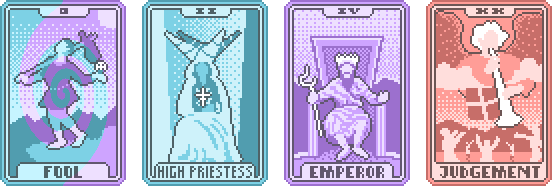
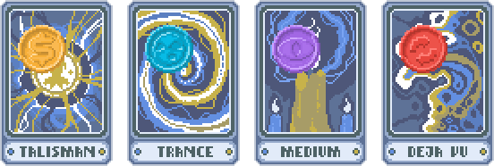

# Balatro Vanilla Essence

Vanilla Essence is a simple texture pack for the game Balatro featuring many ideas from the Balatro [Subreddit](https://www.reddit.com/r/balatro/) and [Discord](https://discord.com/invite/balatro).

Disclaimer: This work has been inspired by and has used some assets from other authors. Credits to their respective authors.

The most relevant features are:

- Standard two-color suits for normal mode.

  

- Standard four-color suits for high-contrast mode (inspired by [@owennerd123](https://www.reddit.com/r/balatro/comments/1bgcmf4/four_color_deck_replacement_to_match_the_standard/)).

  

- Sins and gems Joker colors match the four-color suits (inspired by [@ywssp](https://discord.com/channels/1116389027176787968/1236681231262027906)).

  
  

- Suit-conversion tarots have the sky colored matching the four-color suits (inspired by [@ywssp](https://discord.com/channels/1116389027176787968/1292684173735366769)).

  

- Card-enhancement tarots match their effect (inspired by and some assets from [@Ardit](https://github.com/Ard1tion/Improved-Booster-Tarots/releases/latest) and [@Moonspell](https://discord.com/channels/1116389027176787968/1292684173735366769)).

  
  
  

- Card-creation tarots are full-body colored. The planet and tarot creation cards match the colors of the planet and tarot seals, respectively (inspired by [@Moonspell](https://discord.com/channels/1116389027176787968/1292684173735366769)).

  

- Seal symbols match their effect (inspired by and some assets from [@Iwas_alwaysLuna](https://discord.com/channels/1116389027176787968/1216064295633289286)). Seal-creation spectral cards have the seal stamped on them (inspired by [@Moonspell](https://discord.com/channels/1116389027176787968/1292684173735366769)).

  

- Planet cards use the black-figure card icon for the poker hands when possible (larger and more legible). When the poker hand requires cards of the same suit, the background of the card is light-yellow colored.

  

## Installation

1) Download the latest version of the texture pack from [releases](https://github.com/MKReyesH/BalatroVanillaEssence/releases/latest).
1) Extract and move the ```resource``` folder inside ```C:\Users\[Your User]\AppData\Roaming\Balatro```.

